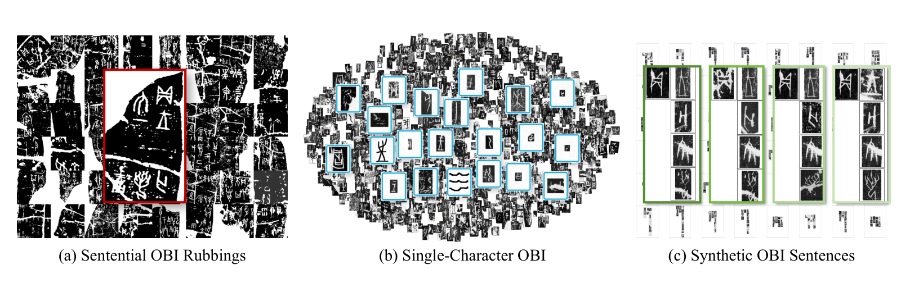
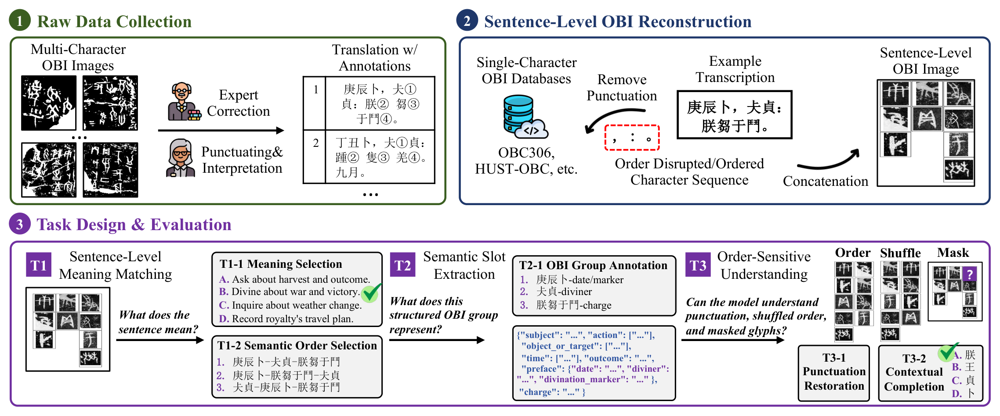
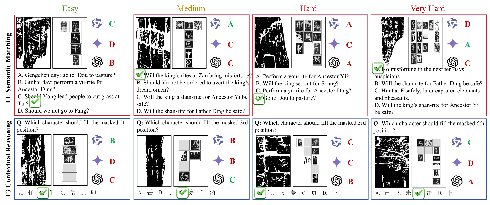

<div align="center">

# S-OBI

**Beyond Single Character: Evaluating MLLMs for Sentence-Level Oracle Bone Inscription Understanding**

Ziqi Li · Zijian Chen · Tingzhu Chen · Guangtao Zhai · **ICIG 2026**

<p>
  <a href="https://github.com/OBI-Future/S-OBI/releases/tag/v1.0.0"></a>
  <a href="https://github.com/OBI-Future/S-OBI"></a>
  <a href="https://github.com/OBI-Future/S-OBI/actions/workflows/tests.yml"></a>
  <a href="https://github.com/OBI-Future/S-OBI/releases/tag/v1.0.0"></a>
</p>

<p>
  <a href="#概览">概览</a> ·
  <a href="#下载数据">数据集</a> ·
  <a href="#快速开始">快速开始</a> ·
  <a href="#评测与结果报告">评测</a> ·
  <a href="#引用">引用</a>
</p>

<p><a href="README.md">English</a> · <a href="https://github.com/OBI-Future/S-OBI/releases/tag/v1.0.0">Dataset Release</a></p>

</div>

## 概览

S-OBI 是一个面向多模态大语言模型（MLLM）的句子级甲骨文理解评测基准，配套论文发表于 ICIG 2026。它考察模型能否将甲骨文图像与句子含义、语义结构、顺序、标点和上下文联系起来。

<p align="center">
  <a href="assets/figures/fig1_obi_sources.png"></a>
</p>
<p align="center"><sub><strong>论文 Fig. 1。</strong> S-OBI 所覆盖的甲骨文形态与句子级构建示例。</sub></p>

<table align="center">
  <tr>
    <td align="center"><strong>95</strong><br>条基础铭文</td>
    <td align="center"><strong>695</strong><br>道评测题</td>
    <td align="center"><strong>3</strong><br>类任务</td>
  </tr>
</table>

数据包包含 95 张原始 JPG 图像和 505 张 PNG 基准图像。S-OBI 没有官方 train/validation/test 划分；来源元数据中出现的 `train` 等标记不构成 S-OBI 的数据划分。

## 任务

| 任务 | 评测重点 | 构成 | 题目数 |
| --- | --- | --- | ---: |
| **T1** | 句子含义与顺序 | 95 道含义题 + 95 道翻译顺序题 | **190** |
| **T2** | 语义槽抽取 | 95 道基础题 + 255 道随机替换题 | **350** |
| **T3** | 顺序敏感理解 | 95 道有序网格分句题 + 60 道遮挡字符上下文题 | **155** |
| **合计** | 三类任务 | — | **695** |

### 构建流程

<p align="center">
  <a href="assets/figures/fig2_construction_pipeline.png"></a>
</p>
<p align="center"><sub><strong>论文 Fig. 2。</strong> 论文中的数据构建流程与任务设计；当前 Release 的正式任务以本页表格和数据包为准。</sub></p>

T1 对含义题使用选项准确率，对顺序题另外评估单元位置、相邻单元和单元集合。T2 要求输出 JSON 对象，字段包括 `subject`、`action`、`object_or_target`、`time`、`outcome`、`preface` 和 `charge` 等。T3 覆盖从有序网格恢复标点，以及根据上下文恢复被遮挡字符。

### 任务案例

<p align="center">
  <a href="assets/figures/fig4_task_case_studies.png"></a>
</p>
<p align="center"><sub><strong>论文 Fig. 4。</strong> 四种难度下的语义匹配与上下文推理案例，图中模型回答来自论文实验。</sub></p>

三张插图均取自论文。原始图号和页码见[图片来源说明](assets/figures/README.md)，点击图片可查看完整分辨率。

## 下载数据

请从 [v1.0.0 GitHub Release](https://github.com/OBI-Future/S-OBI/releases/tag/v1.0.0) 下载 `sentence-OBI.zip`。本仓库只覆盖这一份数据包的分发；任务文件和 gold 标注不会提交到 Git。

安装工具包后运行：

```bash
python scripts/download_data.py
```

下载脚本会校验 [`data/SHA256SUMS`](data/SHA256SUMS) 中的 SHA-256 值，忽略 macOS `__MACOSX/` 元数据，并安全解压到 `data/sentence-OBI/`。如果已有本地 ZIP，可运行：

```bash
python scripts/download_data.py --archive /path/to/sentence-OBI.zip
```

数据条款、已知限制和数据包字段说明见 [`data/README.md`](data/README.md) 与 [`docs/dataset.md`](docs/dataset.md)。

## 快速开始

工具要求 Python 3.10 或更高版本，只使用 Python 标准库，不会下载模型或调用外部 API。

```bash
git clone https://github.com/OBI-Future/S-OBI.git
cd S-OBI
python3 -m venv .venv
source .venv/bin/activate
python -m pip install -e .
python scripts/download_data.py
```

校验正式任务文件并查看模型可见输入：

```bash
python -m sobi.validate --dataset-root data/sentence-OBI
python -m sobi.inspect --dataset-root data/sentence-OBI --task T1 --limit 3
```

生成预测模板并评测已完成的预测文件：

```bash
python evaluation/score_benchmark.py \
  --dataset-root data/sentence-OBI \
  --write-template

python evaluation/score_benchmark.py \
  --dataset-root data/sentence-OBI \
  --predictions path/to/predictions.jsonl \
  --output-dir .runtime/evaluation/results/my_model
```

模板默认写入 `.runtime/evaluation/prediction_template.jsonl`。评测器也接受包含 `task_id,prediction` 列的 CSV。公开的预测格式见 [`evaluation/README.md`](evaluation/README.md)。

<details>
<summary><strong>可选：不接入模型运行端到端冒烟检查</strong></summary>

确定性的 mock 后端可以用 5 条预测检查流程。它仅用于冒烟测试，不是 benchmark baseline。

```bash
python -m examples.run_inference \
  --dataset-root data/sentence-OBI \
  --mock \
  --limit 5 \
  --output .runtime/predictions/smoke.jsonl
python evaluation/score_benchmark.py \
  --dataset-root data/sentence-OBI \
  --predictions .runtime/predictions/smoke.jsonl \
  --output-dir .runtime/evaluation/results/smoke
```

</details>

<details>
<summary><strong>接入自己的 MLLM 后端</strong></summary>

提供一个形如 `module:function` 的 Python 函数。后端接收不含 gold 答案的 `Task.model_input()`，并且必须返回可 JSON 序列化的预测。

```python
# my_backend.py
from collections.abc import Mapping
from typing import Any

def predict(task: Mapping[str, Any]) -> Any:
    # task 包含 task_id、benchmark、question、options、image 和 metadata。
    return call_your_model(task)
```

运行：

```bash
python -m examples.run_inference \
  --dataset-root data/sentence-OBI \
  --backend my_backend:predict \
  --output .runtime/predictions/my_model.jsonl
```

选择题返回选项标签或文本，T2 返回 JSON 对象，T3 开放题返回字符串。模型凭据和本地 API 配置应放在仓库之外。

</details>

## 评测与结果报告

评测器输出逐题结果、按任务和子任务统计的结果，以及按难度和图像类型统计的结果，并给出 `item_macro_primary_score` 和 `balanced_task_primary_score`。推荐将 `balanced_task_primary_score` 作为工具包的总分，即 T1、T2、T3 三个任务均值的算术平均。

这些是随数据包提供的加权评测协议。本仓库不宣称仅运行该评测器即可复现 ICIG 2026 论文中的 accuracy 表格；复现还需要相同的模型输出、预处理、提示词和评测条件。报告时请同时给出三个任务分数和总分，并说明是否省略题目。

## 可复现性与数据条款

每次报告结果时请保留数据包版本和校验值、模型名称与版本、图像预处理、提示词、解码参数、预测文件以及评测输出。缺失预测按该题 0 分处理，发布结果前请检查逐题 CSV。

仓库的 MIT 许可证适用于代码。提供的数据包没有单独的许可证声明，因此数据许可证目前为**未指定**，不能从代码许可证推断。请在权利人允许的范围内使用和重新分发数据包；制作衍生数据集前请阅读 [`data/README.md`](data/README.md)。

## 引用

使用 S-OBI 时请引用 ICIG 2026 论文：

```bibtex
@inproceedings{li2026sobi,
  title     = {Beyond Single Character: Evaluating MLLMs for Sentence-Level Oracle Bone Inscription Understanding},
  author    = {Li, Ziqi and Chen, Zijian and Chen, Tingzhu and Zhai, Guangtao},
  booktitle = {Proceedings of the International Conference on Image and Graphics (ICIG)},
  year      = {2026}
}
```

机器可读的引用信息见 [`CITATION.cff`](CITATION.cff)。在正式书目信息可核实前，本文档不填写 DOI 或页码。

## 仓库结构

| 路径 | 用途 |
| --- | --- |
| `evaluation/` | 评测协议和评测器 |
| `examples/` | 与模型无关的预测示例 |
| `scripts/` | 本地数据和预测工具 |
| `src/sobi/` | 可复用的数据工具 |
| `data/README.md` | 数据包说明和数据条款 |
| `docs/dataset.md` | 详细字段和任务统计 |

版本变更见 [`CHANGELOG.md`](CHANGELOG.md)。
